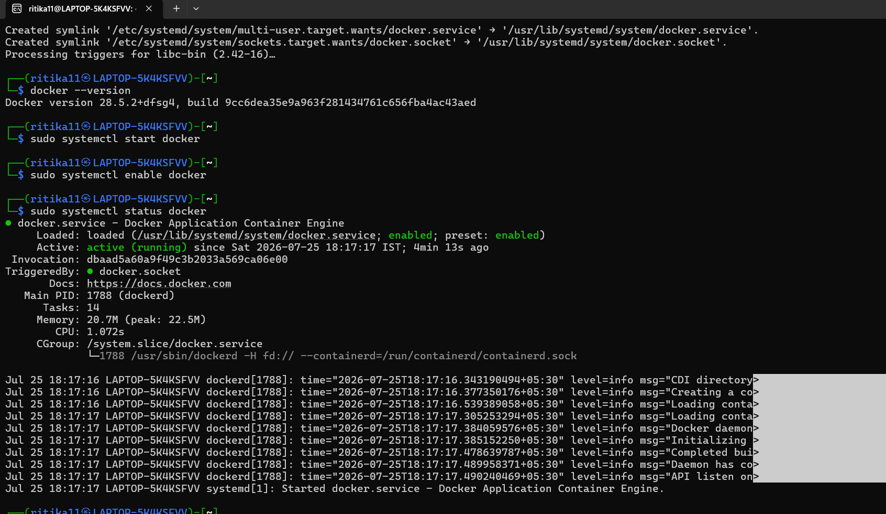
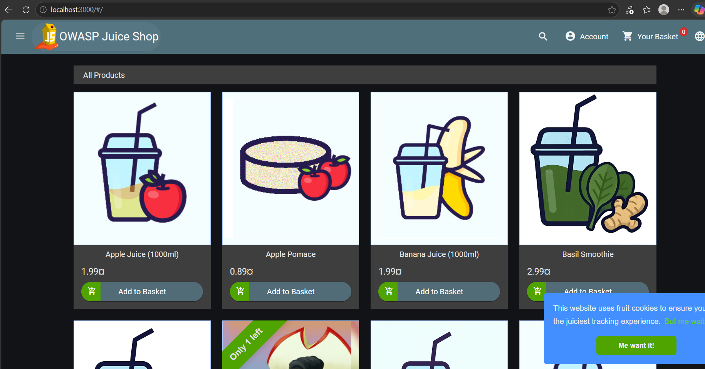
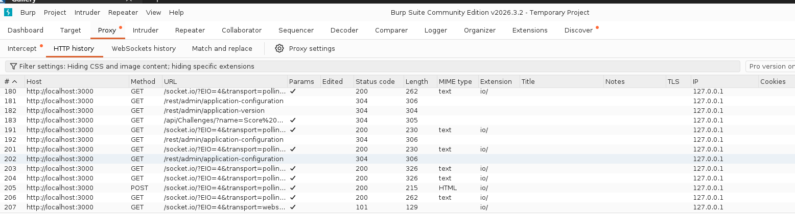
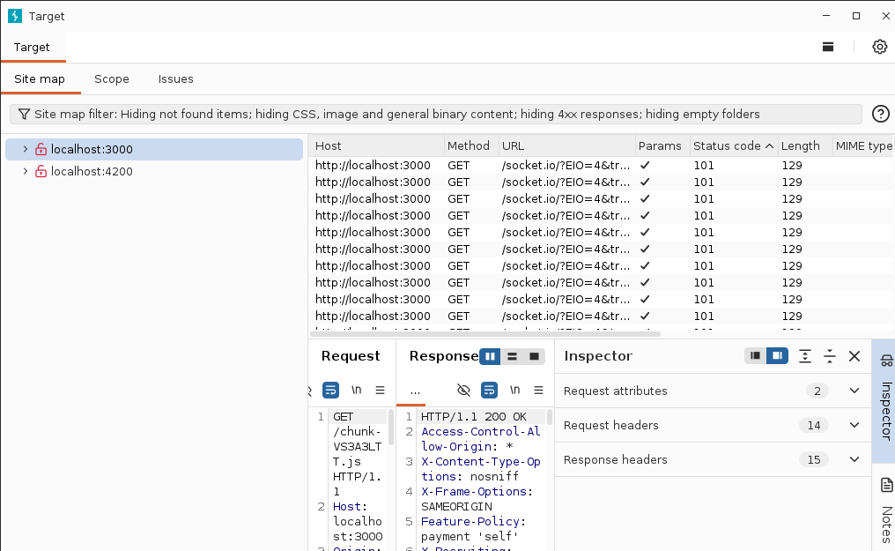
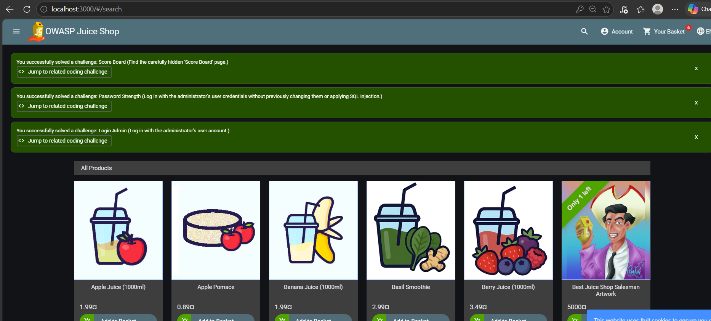

# 🔐 Web Application Penetration Testing Lab using OWASP Juice Shop

## 📌 Project Overview

This project demonstrates the setup of a web application penetration testing lab using **OWASP Juice Shop**, **Docker**, **Kali Linux**, and **Burp Suite Community Edition**.

The purpose of this lab is to understand how penetration testers analyze web applications, capture HTTP traffic, identify vulnerabilities, and document security findings in a safe and legal environment.

> ⚠️ This lab is intended for educational purposes only and was conducted on the intentionally vulnerable OWASP Juice Shop application.

---

# 🎯 Objectives

- Set up a local penetration testing lab
- Deploy OWASP Juice Shop using Docker
- Configure Burp Suite for HTTP traffic interception
- Perform reconnaissance on the application
- Analyze requests and responses
- Document security findings professionally

---

# 🛠️ Tools Used

- Kali Linux
- Docker
- OWASP Juice Shop
- Burp Suite Community Edition

---

# 🧪  Lab Workflow

✔ Installed Docker on Kali Linux

✔ Started and verified Docker service

✔ Deployed OWASP Juice Shop using Docker

✔ Accessed Juice Shop on localhost:3000

✔ Configured Burp Suite Community Edition

✔ Captured HTTP requests using Burp Proxy

✔ Explored the application using Target Site Map

✔ Solved initial OWASP Juice Shop challenges

---

# ✅ Progress

- [x] Docker Installed
- [x] OWASP Juice Shop Deployed
- [x] Burp Suite Installed
- [x] HTTP Request Interception
- [x] Reconnaissance
- [x] SQL Injection Testing
- [x] Cross-Site Scripting (XSS)
- [ ] CSRF Testing
- [ ] Security Findings Report

---

# 📷 Screenshots

- Docker Installation and service verification
- OWASP Juice Shop Homepage
- Burp Suite HTTP History
- Burp Suite Target Site Map
- Initial OWASP Juice Shop Challenges

---

# 📚 Learning Outcomes

- Learned Docker container deployment
- Understood web application proxying using Burp Suite
- Captured and analyzed HTTP requests
- Explored application endpoints using Target Site Map
- Practiced with OWASP Juice Shop security challenges

---

# 🚀 Future Enhancements

- SQL Injection Assessment
- Cross-Site Scripting (XSS)
- Authentication Testing
- Session Management Testing
- Professional Penetration Testing Report
- OWASP Top 10 Mapping

---

# ⚠️ Disclaimer

This project was performed only on OWASP Juice Shop, an intentionally vulnerable web application designed for security training. No unauthorized testing was conducted against real-world systems.

## Screenshots

### 1. Docker Installation and Service Verification

### 2. OWASP Juice Shop Running

### 3. Burp Suite HTTP History

### 4. Burp Suite Target Site Map

### 5. Initial OWASP Juice Shop Challenges

